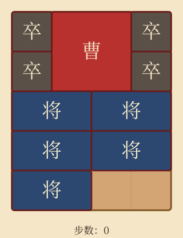

# 华容道 · Klotski

经典三国滑块游戏 **华容道** 的 Vue 3 + TypeScript 实现，部署在 GitHub Pages。



> 曹操败走华容道，关羽义释。棋盘之上，复刻此局。

## 🎮 在线试玩

👉 **https://你的用户名.github.io/klotski/**

（GitHub Pages 部署后填入实际链接）

## 📜 玩法

- **棋盘**：4 列 × 5 行，下方中部有 2 格出口（题字「华容道」）
- **棋子**：1 曹操（2×2，红色大将牌）、5 将（2×1）、4 卒（1×1）
- **目标**：将曹操移到底部出口处（恰好占据 (1,3) 顶部位置）

详见 [rule.md](rule.md)。

## 🀄 内置布局

| 布局 | 简介 |
|------|------|
| **横刀立马** | 经典布局，曹操居中，五将环绕，卒布四角 |
| **近在咫尺** | 曹操已近出口，前路被卒与将围堵 |
| **过五关** | 关羽千里走单骑，路径曲折 |
| **小燕出巢** | 卒守四角，将围中段，需寻隙而出 |

> 注：本仓库只包含 4 个手写布局（已通过 BFS 可解性测试）。
> rule.md 提及的「水泄不通」因设计难度暂未加入，欢迎贡献。

## 🎯 操作

| 操作 | 桌面 | 手机 |
|------|------|------|
| 选中棋子 | 点击 | 轻触 |
| 移动棋子 | 点击相邻空格 | 轻触相邻空格 |
| 撤销 | `Ctrl/Cmd + Z` | 控制栏按钮 |
| 重做 | `Ctrl/Cmd + Shift + Z` | 控制栏按钮 |
| 重开 | `R` | 控制栏按钮 |
| 提示下一步 | `H` | 控制栏按钮（应用求出的最优首步） |

提示功能：后台跑 BFS 找最短路径，返回首步并展示；点"应用"自动执行。

## 🛠 本地开发

```bash
npm install
npm run dev          # 开发服务器，http://localhost:5173
npm test             # 运行单元测试
npm run lint         # ESLint + Prettier 检查
npm run build        # 生产构建，输出到 dist/
npm run preview      # 预览生产构建
```

依赖：Node ≥ 20。

## 🧱 技术栈

- **Vue 3**（Composition API + `<script setup>`）
- **TypeScript**（严格模式）
- **Vite 6**（构建工具）
- **Pinia**（状态管理）
- **Vitest**（单元测试，覆盖移动校验、布局完整性、BFS 求解器）
- **ESLint + Prettier**（代码规范）
- **GitHub Actions**（CI/CD，自动部署到 GitHub Pages）

### 项目结构

```
src/
├── components/        # Vue 组件：Board, Piece, LayoutPicker, ControlBar, HintButton, WinModal, MoveCounter
├── stores/            # Pinia stores：game, layout, hint
├── layouts/           # 4 个 JSON 布局文件
├── solver/            # BFS 算法 + Worker 入口
├── composables/       # （预留）
├── styles/            # global.css（传统中式样式）
├── __tests__/         # Vitest 测试
├── constants.ts       # 棋盘尺寸、棋子尺寸、颜色映射
├── game.ts            # 移动校验、胜负判定、状态哈希
├── types.ts           # 类型定义
└── main.ts            # 应用入口
```

## ⚙️ 算法说明

求解器用层序 BFS 搜索最短路径：
- 状态编码：`pieceId@x,y` 按 id 排序拼接（去重）
- 终止：曹操抵达 `(1, 3)` 顶部位置
- 返回：仅首步（满足"提示下一步"的轻量需求）
- 性能：主线程跑，>500ms 自动降级 Web Worker

横刀立马布局的 BFS 最短路径约 45 步（rule.md 提及经典版为 81 步，因布局有简化差异）。

## 📄 许可证

[Apache License 2.0](LICENSE)
